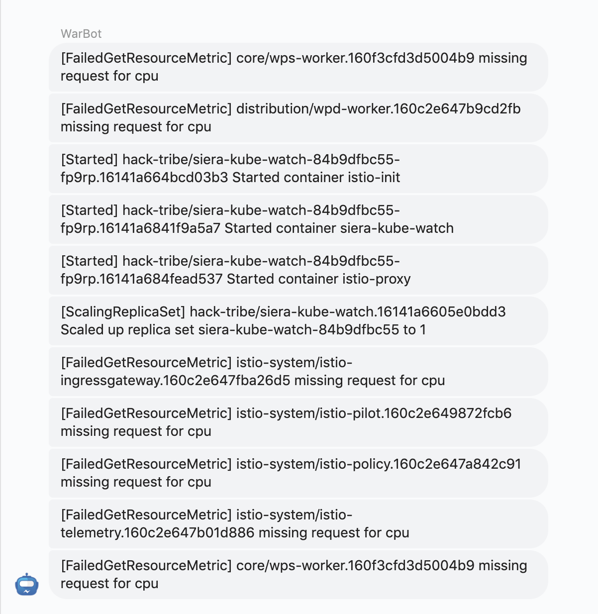
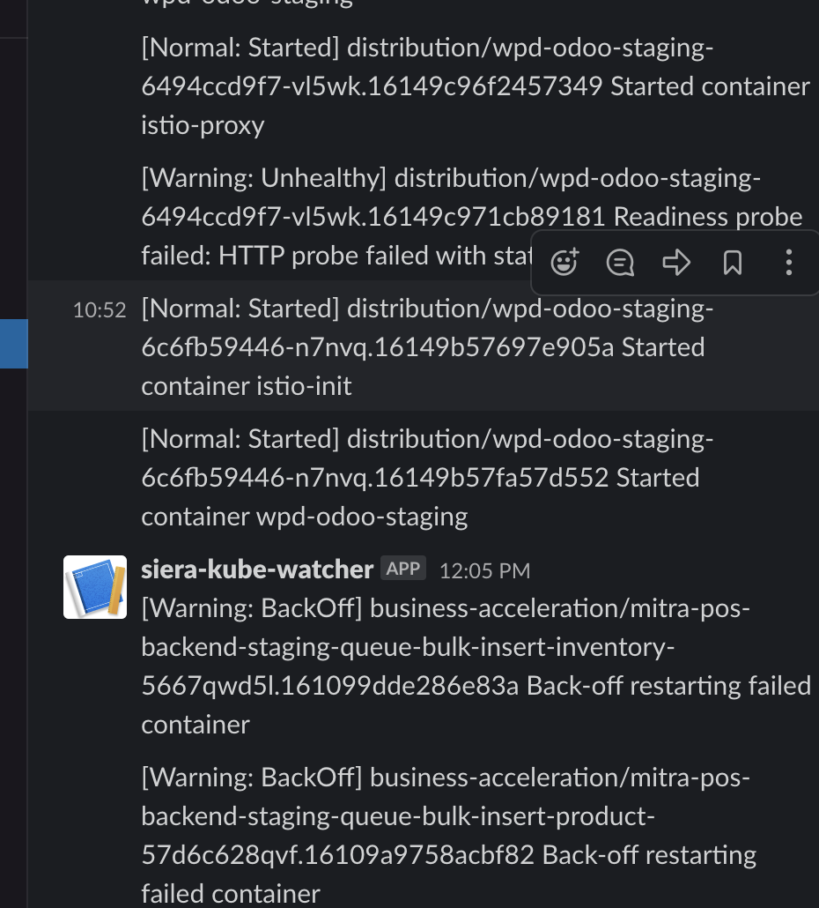
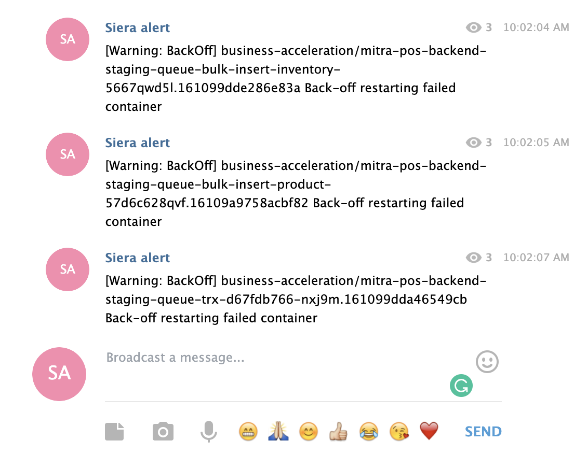

## SIERA KUBE WATCH

[siera kubewatch](https://github.com/warungpintar/siera-kube-watch) is a Kubernetes events watcher that aims to publish incident (unexpected event) as a notification through webhooks.

Supported webhooks:
- slack
- telegram
- webhook

## TL;DR

add repository 
```
$ helm repo add warpincharts  https://warungpintar.github.io/charts
$ helm search repo warpincharts
```

install with webhook
```
$ helm install siera-kube-watch -n [your namespace]  warpincharts/siera-kube-watch \
  --set=config.webhook.enabled="true",config.webhook.url="http://webhookurl"
```
install with slack
```
$ helm install siera-kube-watch -n [your namespace]  warpincharts/siera-kube-watch \
  --set=config.slack.enabled="true",config.webhook.url="https://hooks.slack.com/services/TOKEN" 
```

install with telegram
```
$ helm install siera-kube-watch -n [your namespace]  warpincharts/siera-kube-watch \
  --set=config.telegram.enabled="true",config.telegram.token="123456:ABC-DEF1234ghIkl-zyx57W2v1u123ew11",config.telegram.chatID="-1234567890123"
```

## Parameters

The following table lists the configurable parameters of the siera kube watch chart and their default values.

| Parameter                                | Description                                                                                                                 | Default                                                    |
|------------------------------------------|-----------------------------------------------------------------------------------------------------------------------------|------------------------------------------------------------|
| `metadata.name       `                   | Global name                                                                                                                 | `siera-kube-watch`                                         |
| `image.repository`                       | Image repository                                                                                                            | `warungpintar/siera-kube-watch`                            |
| `image.tag`                              | Image tag                                                                                                                   | `v1.0.0`                                                   |
| `image.pullPolicy`                       | Image pull policy                                                                                                           | `IfNotPresent`                                             |
| `config.webhook.enabled`                 | boolean to enable or disable webhook                                                                                        | `false`                                                    |
| `config.webhook.url`                     | url of webhook                                                                                                              | ``                                                         |
| `config.slack.enabled`                   | boolean to enable or disable slack                                                                                          | `false`                                                    |
| `config.slack.url`                       | url of slack                                                                                                                | `https://hooks.slack.com/services/TOKEN`                   |
| `config.telegram.enabled`                | boolean to enable or disable slack                                                                                          | `false`                                                    |
| `config.telegram.token`                  | url of telegram api                                                                                                         | `https://api.telegram.org/botTOKEN/sendMessage?chat_id=-XX`|                                                      
| `config.telegram.chatID`                 | url of telegram api                                                                                                         | `https://api.telegram.org/botTOKEN/sendMessage?chat_id=-XX`|                                                      
| `excluded.reasons`                       | In case you want to filter your event stream from specific reason, you can add that reason to excluded.reasons.             | `[]`                                                       |                                                      
| `include.reasons`                        | In case you want to add normal reason to your event stream from specific reason.                                            | `["ScalingReplicaSet", "Started", "Killing"]`              |                                                      
| `included.namespaces`                    | By default we include event from all namespaces, but you can filter namespace that you want to watch for.                   | ``                                                         |                                                      


Alternatively, a YAML file that specifies the values for the above parameters can be provided while installing the chart. For example,
 
```
$ helm install siera-kube-watch -n [your namespace] -f values.yaml warpincharts/siera-kube-watch 
```

## Result webhook


## Result slack


## Result telegram


docker image size  35.2MB